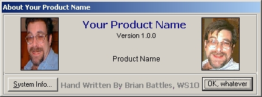

<div align="center">

## Goofy About Box


</div>

### Description

Silly, fun animated About Box for your applications (use your own pictures!) Even plays dopey sound effects!
 
### More Info
 
Uses a timer to "bounce" a couple of pictureboxes around on a form. Nothing complicated, but fun and easy to use with your application.

(The graphic here doesn't do it justice because it's animated...)

None known


<span>             |<span>
---                |---
**Submitted On**   |2001-12-13 18:40:16
**By**             |[Brian Battles WS1O](https://github.com/Planet-Source-Code/PSCIndex/blob/master/ByAuthor/brian-battles-ws1o.md)
**Level**          |Beginner
**User Rating**    |4.4 (44 globes from 10 users)
**Compatibility**  |VB 6\.0
**Category**       |[Custom Controls/ Forms/  Menus](https://github.com/Planet-Source-Code/PSCIndex/blob/master/ByCategory/custom-controls-forms-menus__1-4.md)
**World**          |[Visual Basic](https://github.com/Planet-Source-Code/PSCIndex/blob/master/ByWorld/visual-basic.md)
**Archive File**   |[Goofy\_Abou4205812142001\.zip](https://github.com/Planet-Source-Code/brian-battles-ws1o-goofy-about-box__1-29774/archive/master.zip)

### API Declarations

```
Private Declare Function PlaySound Lib "winmm.dll" Alias "PlaySoundA" (ByVal lpszName As String, ByVal hModule As Long, ByVal dwFlags As Long) As Long
Private Declare Function BitBlt Lib "gdi32" (ByVal hDestDC As Long, ByVal X As Long, ByVal Y As Long, ByVal nWidth As Long, ByVal nHeight As Long, ByVal hSrcDC As Long, ByVal xSrc As Long, ByVal ySrc As Long, ByVal dwRop As Long) As Long
Private Declare Function RegOpenKeyEx Lib "advapi32" Alias "RegOpenKeyExA" (ByVal hKey As Long, ByVal lpSubKey As String, ByVal ulOptions As Long, ByVal samDesired As Long, ByRef phkResult As Long) As Long
Private Declare Function RegQueryValueEx Lib "advapi32" Alias "RegQueryValueExA" (ByVal hKey As Long, ByVal lpValueName As String, ByVal lpReserved As Long, ByRef lpType As Long, ByVal lpData As String, ByRef lpcbData As Long) As Long
Private Declare Function RegCloseKey Lib "advapi32" (ByVal hKey As Long) As Long
```


